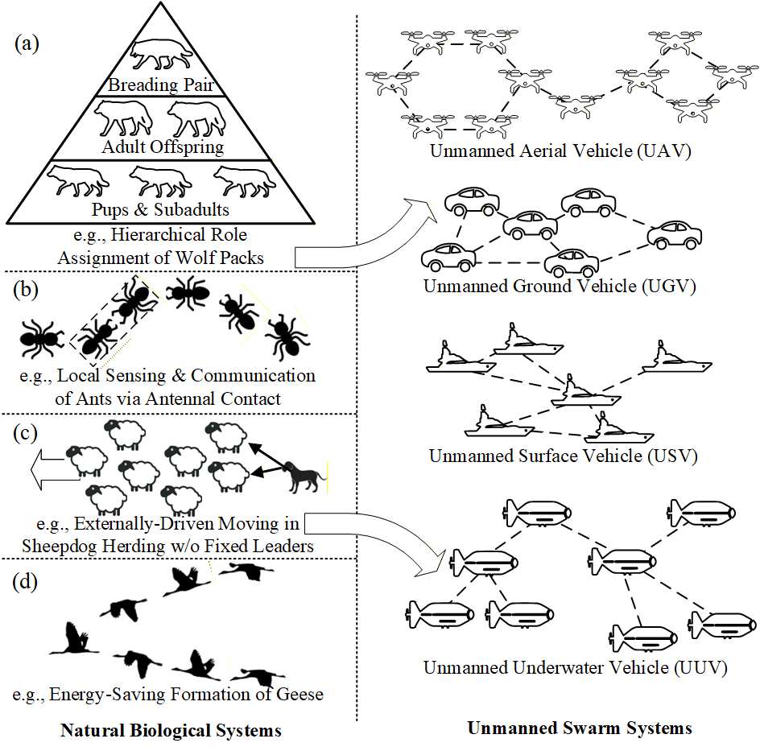
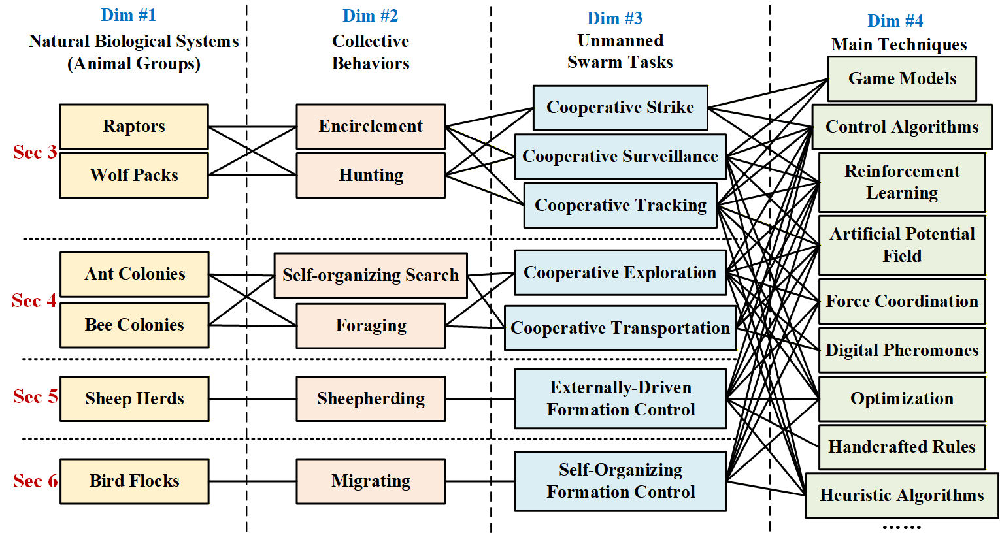
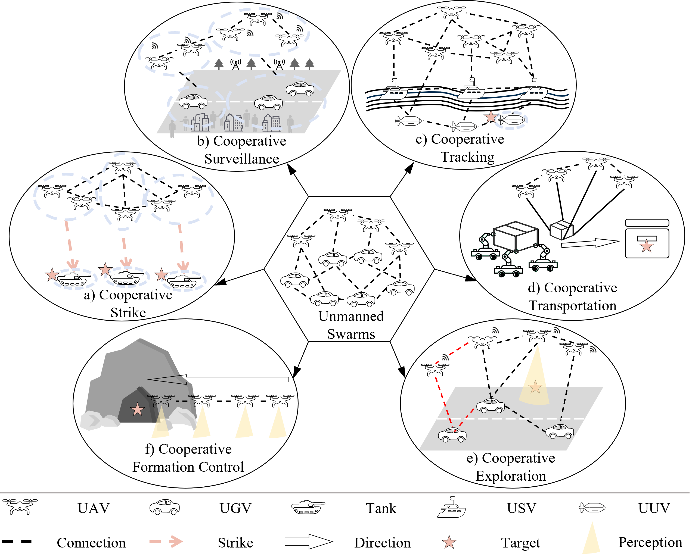
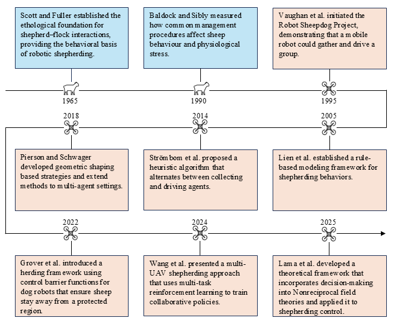

# Mapping Animal Collective Behaviors to Unmanned Swarm Tasks: A Comprehensive Review of Bio-inspired Swarm Robotics

## Abstract
Bio-inspired unmanned swarm robotic, which aims to leverage swarm intelligence from natural biological systems (e.g., cooperative encirclement of wolf packs and self-organizing foraging of ant colonies) to unmanned swarm systems, provides promising solutions to alleviating the coordination challenge of complex missions (e.g., cooperative strike and exploration). This survey provides a comprehensive review of existing bio-inspired approaches for unmanned swarms. Concretely, we propose a hierarchical fine-grained taxonomy to categorize all the related methods via four dimensions, covering (i) six types of animal groups, (ii) six types of collective behaviors, (iii) seven sets of high-level unmanned swarm tasks, and (iv) more than nine commonly-used techniques. Such a taxonomy can describe the mapping correspondence about how a related method is motivated by which collective behavior of an animal group to support which task via what techniques. As a conclusion, we further summarize some common challenges in related studies and indicate possible future prospects.

## Citing
TBD

## Related Surveys

### Only Collective Behaviors of Natural Animal Groups But No/Limited Applications in Unmanned Swarm Systems

1. [Collective Motion](https://www.sciencedirect.com/science/article/pii/S0370157312000968). Vicsek, Tamás, and Anna Zafeiris. *Physics Reports*, 2012.
2. [Computing with the Collective Intelligence of Honey Bees --- A Survey](https://www.sciencedirect.com/science/article/pii/S221065021630027X). Rajasekhar, Anguluri, et al. *Swarm & Evolutionary Computation*, 2017.
3. [The Ecology of Collective Behavior in Ants](https://www.annualreviews.org/content/journals/10.1146/annurev-ento-011118-111923). Gordon, Deborah M. *Annual Review of Entomology*, 2019.
4. [Wolf Pack Algorithm: An Overview](https://link.springer.com/chapter/10.1007/978-981-96-0795-2_8). Xu, Wei, et al. *International Conference on Intelligent Robotics & Applications (ICIRA)*, 2024.
5. [Foraging by Predatory Ants: A Review](https://onlinelibrary.wiley.com/doi/full/10.1111/1744-7917.13461). Dejean, Alain, et al. *Insect Science*, 2025.
6. [Schwarmbienen auf Wohnungssuche(English:House-Hunting by Swarm Bees)](https://link.springer.com/article/10.1007/BF00303153). Lindauer, M. *Z. Vergl. Physiol*, 1955.
7. [Group Decision Making in Honey Bee Swarms](https://www.researchgate.net/publication/242086450_Group_Decision_Making_in_Honey_Bee_Swarms). Visscher, P. and Seeley, T. and Passino, Kevin. *American Scientist*, 2006.
8. [Group decision making in swarms of honey bees](https://link.springer.com/article/10.1007/s002650050536).Seeley, T., Buhrman, S. *Behav Ecol Sociobiol*, 1999. 
9. [Stop Signals Provide Cross Inhibition in Collective Decision-Making by Honeybee Swarms](https://www.science.org/doi/10.1126/science.1210361). Seeley, T., et al. *Science*, 2012.

### Only Unmanned Swarm Robotics But No/Limited Bio-inspired Applications

1. [A Survey on Aerial Swarm Robotics](https://ieeexplore.ieee.org/abstract/document/8424838). Chung, Soon-Jo, et al. *IEEE Transactions on Robotics*, 2018.
2. [UAV Swarms: Research, Challenges, and Future Directions](https://link.springer.com/article/10.1186/s44147-025-00582-3). Alqudsi, Yunes, and Murat Makaraci. *Journal of Engineering & Applied Science*, 2025.
3. [A Comprehensive Review of Next-Gen UAV Swarm Robotics: Optimisation Techniques and Control Strategies for Dynamic Environments](https://www.techscience.com/iasc/v40n1/59313/html). Abro, G. E. M., et al. *Intelligent Automation & Soft Computing*, 2025.
4. [A Survey on Autonomous and Intelligent Swarms of Uncrewed Aerial Vehicles (UAVs)](https://ieeexplore.ieee.org/abstract/document/11010841). Du, Zhenpeng, et al. IEEE Transactions on Intelligent Transportation Systems, 2025.

### Bio-inspired Unmanned Swarm Robotics

1. [Swarm Robotics: a Review from the Swarm Engineering Perspective](https://link.springer.com/article/10.1007/s11721-012-0075-2). Brambilla, Manuele, et al. *Swarm Intelligence*, 2013.
2. [A Comprehensive Review of Shepherding as a Bio-inspired Swarm-robotics Guidance Approach](https://ieeexplore.ieee.org/abstract/document/9099485). Long, Nathan K., et al. *IEEE Transactions on Emerging Topics in Computational Intelligence*, 2020.
3. [Wolf Pack Intelligence: From Biological Intelligence to Cooperative Control for Swarm Robotics](https://link.springer.com/chapter/10.1007/978-981-15-8155-7_408). Hu, Jinqiang, Husheng Wu, and Renjun Zhan. *International Conference on Guidance, Navigation & Control (ICGNC)*, 2021.
4. [Swarm Robotics Behaviors and Tasks: A Technical Review](https://link.springer.com/chapter/10.1007/978-3-030-74540-0_5). Majid, M. H. A., M. R. Arshad, and R. M. Mokhtar. *Control Engineering in Robotics and Industrial Automation*, 2021.
5. [From Animal Collective Behaviors to Swarm Robotic Cooperation](https://academic.oup.com/nsr/article-abstract/10/5/nwad040/7043485). Duan, Haibin, Mengzhen Huo, and Yanming Fan. *National Science Review*, 2023.

## From Predator Encirclement and Hunting to Cooperative Strike, Surveillance, and Tracking
### From Raptor Encirclement and Hunting to Cooperative Strike, Surveillance, and Tracking

1. [Hawk-rabbit game architecture for unmanned aerial vehicle swarm multi-target defense under uncertain attack targets](https://www.sciencedirect.com/science/article/abs/pii/S127096382500450X). Wei Yue, Xiaoyong Zhang. *Aerospace Science and Technology*, 2025.
2. [Hawk-Pigeon Game Tactics for Unmanned Aerial Vehicle Swarm Target Defense](https://ieeexplore.ieee.org/document/10050779). Ruan, Wanying and Sun, Yongbin and Deng, Yimin and Duan, Haibin. *IEEE Transactions on Industrial Informatics*, 2023.
3. [Multi-Agents Cooperative Target Tracking Under Physical Attacks With Environment-Aware Dynamic Constraints](https://ieeexplore.ieee.org/document/11154039). Hu, Zhongjun and Hoagg, Jesse B. and Jin, Xu. *IEEE Transactions on Automation Science and Engineering*, 2025.
4. [Multi-UAV Interception Inspired by Harris’ Hawks Cooperative Hunting Behavior](https://ieeexplore.ieee.org/document/9739214). Tong, Bingda and Liu, Jichuan and Duan, Haibin. *2021 IEEE International Conference on Robotics and Biomimetics (ROBIO)*, 2021.
5. [Optimal spatial–temporal triangulation for bearing-only cooperative motion estimation](https://www.sciencedirect.com/science/article/abs/pii/S0005109825001086). Canlun Zheng and Yize Mi and Hanqing Guo and Huaben Chen and Zhiyun Lin and Shiyu Zhao. *Automatica*, 2023.
6. [Three-Dimensional Bearing-Only Target Following via Observability-Enhanced Helical Guidance](https://ieeexplore.ieee.org/document/9946840). Li, Jianan and Ning, Zian and He, Shaoming and Lee, Chang-Hun and Zhao, Shiyu. *IEEE Transactions on Robotics*, 2023.
7. [Deep Reinforcement Learning-Based Diving/Pull-out Control for Bioinspired Morphing UAVs](https://www.worldscientific.com/doi/10.1142/S2301385023410066). Ye, Bobo and Li, Jie and Li, Juan and Liu, Chang and Li, Jichu and Yang, Yachao. *Unmanned Systems*, 2023.
8. [A Cooperative Bearing-Rate Approach for Observability-Enhanced Target Motion Estimation](https://ieeexplore.ieee.org/document/11128217). Zheng, Canlun and Guo, Hanqing and Zhao, Shiyu. *2025 IEEE International Conference on Robotics and Automation (ICRA)*, 2025.
9. [Bioinspired Bearing–Based Target Enclosing Control for Unmanned Aerial Vehicle Swarm](https://ieeexplore.ieee.org/document/10697318). Deng, Yimin and Zhu, Baitao and Duan, Haibin. *IEEE/ASME Transactions on Mechatronics*, 2025.
10. [Hawks steer attacks using a guidance system tuned for close pursuit of erratically manoeuvring targets](https://www.nature.com/articles/s41467-019-10454-z). Brighton, Caroline H and Taylor, Graham K. *Nature communications*, 2019.
11. [Cooperative Hunting Harris' Hawks (Parabuteo unicinctus)](https://www.nature.com/articles/s41467-019-10454-z). Bednarz J C. *Science*, 1988.
12. [Foraging habits, hunting and breeding success of Lanner Falcons (Falco biarmicus) in Israel](https://www.researchgate.net/publication/231183264_Foraging_habits_hunting_and_breeding_success_of_Lanner_Falcons_in_Israel). YOsEF R. *Journal of Raptor Research*, 1991.
13. [Reexamining Cooperative Hunting in Harris's Hawk (Parabuteo unicinctus): Large Prey or Challenging Habitats?](https://www.nature.com/articles/s41467-019-10454-z). Jennifer O. Coulson, Thomas D. Coulson. *Nature communications*, 2013.

    
### From Wolf Packs Encirclement and Hunting to Cooperative Strike, Surveillance, and Tracking
1. [Unmanned aerial systems coordinate target allocation based on wolf behaviors](https://link.springer.com/article/10.1007/s11432-018-9587-0). Duan, Haibin, et al. *Science China. Information Sciences*, 2019.
2. [Bio-inspired adaptive formation tracking control for swarm systems with application to UAV swarm systems](https://www.sciencedirect.com/science/article/abs/pii/S0925231221007268). Xie, Yuxin, et al. *Neurocomputing*, 2021.
3. [UAV Target Roundup Strategy Based on Wolf Pack Hunting Behavior](https://link.springer.com/chapter/10.1007/978-981-99-2356-4_40). Wang, Tong, et al. *Conference on Computer Supported Cooperative Work and Social Computing*. Singapore: Springer Nature Singapore*, 2022.
4. [Pursuit-evasion games of multiple cooperative pursuers and an evader: A biological-inspired perspective](https://www.sciencedirect.com/science/article/abs/pii/S100757042200079X). Wang, Jianan, et al. *Communications in Nonlinear Science and Numerical Simulation*, 2022.
5. [Multi-player pursuit–evasion games with one superior evader](https://www.sciencedirect.com/science/article/abs/pii/S0005109816301352). Chen, Jie, et al. *Automatica*, 2016.
### The development of the behavior researches of wolf packs

1. [The wolves of Mount McKinley](https://www.degruyterbrill.com/document/doi/10.1515/9780295802695/html).  Murie, Adolph. *The Wolves of Mount McKinley*, 2011.
2. [Expression studies of wolves](https://cir.nii.ac.jp/crid/1573668926142714112). *Behaviour*, 1947.
3. [Wolf-pack buffer zones as prey reservoir](https://www.science.org/doi/abs/10.1126/science.198.4314.320). Mech, L. David. *Science*, 1977.
4. [Alpha status, dominance, and division of labor in wolf packs ](https://cdnsciencepub.com/doi/abs/10.1139/z99-099).  Mech, L. David. *Canadian journal of zoology*, 1999.
5. [Modelling territoriality and wolf–deer interactions](https://www.nature.com/articles/366738a0). Lewis, M. A., and J. D. Murray. *Nature*, 1993.
6. [The wolf as a carnivore](https://iris.uniroma1.it/handle/11573/162727). Peterson, Rolf O., and Paolo Ciucci., *University of Chicago Press*, 2003.
7. [Wolf-pack (Canis lupus) hunting trategies emerge from simple rules  in computational simulations](https://www.sciencedirect.com/science/article/abs/pii/S0376635711001884). Muro, Cristian, et al. , *Behavioural Processes*,  2011.
8. [Multi-robot system based on model of wolf hunting behavior to emulate wolf and elk interactions](https://ieeexplore.ieee.org/abstract/document/5723472). Madden, John D., Ronald C. Arkin, and Daniel R. MacNulty, *In Proceedings of IEEE International Conference on Robotics and​Biomimetics*, Tianjin, 2011. 
9. [Grey wolf optimizer](https://www.sciencedirect.com/science/article/abs/pii/S0965997813001853). Mirjalili, Seyedali, Seyed Mohammad Mirjalili, and Andrew Lewis. *Advances in engineering software*, 2014.
10. [A novel reinforcement learning based grey wolf optimizer algorithm for unmanned aerial vehicles (UAVs) path planning](https://www.sciencedirect.com/science/article/abs/pii/S1568494620300399). Qu, Chengzhi, et al., *Applied soft computing*, 2020.
11. [Hybrid chaos game and grey wolf optimization algorithms for UAV path planning](https://www.sciencedirect.com/science/article/abs/pii/S0307904X2500054X). Yang, Jianqiang, et al.,  *Applied Mathematical Modelling*, 2025.

## From Self-organizing Search and Foraging to Cooperative Exploration and Transportation

1. [Multi-robot exploration and terrain coverage in an unknown environment](https://www.sciencedirect.com/science/article/abs/pii/S0921889011001783). Senthilkumar, K., Bharadwaj, K.K., *Robotics and Autonomous Systems*, 2012.
2. [Ant-based multi-robot exploration in non-convex space without global connectivity constraints](https://ieeexplore.ieee.org/document/8796034).Cardona, G.A., Yanguas-Rojas, D., Arevalo-Castiblanco, M.F., Mojica-Nava, E., *In: 2019 18th European Control Conference (ECC)*, 2019.
3. [Area exploration with a swarm of uavs combining deterministic chaotic ant colony mobility with position mpc.](https://ieeexplore.ieee.org/document/7991418). Rosalie, M., Dentler, J.E., Danoy, G., Bouvry, P., Kannan, S., Olivares-Mendez, M.A., Voos, H., *In: 2017 International Conference on Unmanned Aircraft Systems (ICUAS)*, 2017.
4. [Multi-robot exploration using dynamic fuzzy cognitive maps and ant colony optimization.](https://ieeexplore.ieee.org/document/9177814).Mendon¸ca, M., Pal´acios, R.H., Papageorgiou, E.I., Souza, L.B., *In: 2020 IEEE International Conference on Fuzzy System*, 2020.
5. [Multi-robot exploration of unknown environments with identification of exploration completion and post-exploration rendezvous using ant algorithms.](https://ieeexplore.ieee.org/abstract/document/6697164).Andries, M., Charpillet, F., *In: 2013 IEEE/RSJ International Conference on Intelligent Robots and System*, 2013.
6. [An efficient hierarchical planner for autonomous exploration based on ant colony path optimization](https://ieeexplore.ieee.org/abstract/document/11134133). Liu, H., Wang, Y., Pei, S., Sun, G., Yao, W., *IEEE Sensors Journal*, 2013. 
7. [Multi-robot replication of ant collective towing behaviours](https://royalsocietypublishing.org/rsos/article/5/10/180409/93823/Multi-robot-replication-of-ant-collective-towing). Peterson, Rolf O., and Paolo Ciucci., *Royal Society open science*, 2018.
8. [Ant-inspired control strategies for collective transport by dynamic multi-robot teams with temporary leaders](https://www.proquest.com/openview/1e8760f268bc05945af33b2bac9df553/1?pq-origsite=gscholar&cbl=18750&diss=y). Gah, E., *Arizona State University*,  2020.
10.  [Ant-inspired strategies for multi-robot collaborative transportation-an ockham’s razor](https://www.sciencedirect.com/science/article/pii/S2405896321023120). Barawkar, S., Kumar, M., *IFAC-PapersOnLine*, 2021.
11.  [Recherches sur les Moeurs des Fourmis Indig`enes](https://www.biodiversitylibrary.org/item/105488). Huber, P., *Fischbacher*, 1861.
12.  [Observations on ants, bees, and wasps.—part viii](https://archive.org/details/biostor-284056).  Lubbock, J.,  *Zoological Journal of the Linnean Society*, 1881.
13.  [La reconstruction du nid et les coordinations interindividuelles chez bellicositermes natalensis et cubitermes sp. la th´eorie de la stigmergie](https://link.springer.com/article/10.1007/BF02223791).  Grass´e, P.,  *Elsevier*, 2013.
14.  [Sigmergy 3.0: From ants to economies.](https://www.sciencedirect.com/science/article/abs/pii/S1389041712000368).  Lubbock, J.,  *Zoological Journal of the Linnean Society*, 1881.
15.  [Chemical communication among workers of the fire ant solenopsis saevissima (fr. smith) 1. the organization of mass-foraging.](https://www.sciencedirect.com/science/article/abs/pii/0003347262901410). Doyle, M.J., Marsh, L.,  *Animal behaviour*, 1962.
16.  [Collective patterns and decision-making](https://www.tandfonline.com/doi/abs/10.1080/08927014.1989.9525500).  Deneubourg, J.-L., Goss, S. ,  *Ethology Ecology & Evolution*, 1989.
17.  [Random behaviour, amplification processes and number of participants: How they contribute to the foraging properties of ants](https://www.sciencedirect.com/science/article/abs/pii/0167278986902393).   Deneubourg, J.L., Aron, S., Goss, S., Pasteels, J.,  *hysica D: nonlinear phenomena*, 1986.
18. [Scavenging bypheidole pallidulaa key for under-standing decision-making systems in ants](https://www.sciencedirect.com/science/article/abs/pii/S000334729690305X).  Detrain, C., Deneubourg, J.-L. ,  *Animal behaviour*, 1997.
19. [From nonlinearity to optimality: pheromone trail foraging by ants](https://www.sciencedirect.com/science/article/abs/pii/S000334720392224X).  Sumpter, D.J., Beekman, M.,  *Animal behaviour*, 2009.

## From Shepherding to Externally-Driven Formation Control

1. [Genetics and the social behavior of the dog](https://press.uchicago.edu/ucp/books/book/chicago/G/bo42153960.html). Scott, J. P. & Fuller, J. L. *University of Chicago Press*, Chicago, 1965.
2. [Robot sheepdog project achieves automatic flock control](https://autonomy.cs.sfu.ca/doc/vaughan_sab98.pdf). Vaughan, Richard *et al.* *Proc. Fifth International Conference on the Simulation of Adaptive Behaviour: From Animals to Animats 5*, pp. 489–493, 1998.
3. [Shepherding behaviors with multiple shepherds](https://doi.org/10.1109/ROBOT.2005.1570636). Lien, Jyh-Ming *et al.* *Proc. IEEE International Conference on Robotics and Automation (ICRA)*, pp. 3402–3407, 2005.
4. [An effective simple shepherding algorithm suitable for implementation to a multi-mmobile robot system](https://doi.org/10.1109/ICICIC.2006.411). Miki, Tsutomu & Nakamura, Tetsuya. *Proc. International Conference on Innovative Computing, Information and Control (ICICIC’06)*, vol. 3, pp. 161–165, 2006.
5. [Solving the shepherding problem: heuristics for herding autonomous, interacting agents](https://royalsocietypublishing.org/doi/10.1098/rsif.2014.0719). Strömbom, Daniel *et al.* *Journal of the Royal Society Interface*, 11(100):20140719, 2014.
6. [Bio-inspired non-cooperative multi-robot herding](https://doi.org/10.1109/ICRA.2015.7139438). Pierson, Alyssa & Schwager, Mac. *Proc. IEEE International Conference on Robotics and Automation (ICRA)*, pp. 1843–1849, 2015.
7. [A reinforcement learning approach to the shepherding task using SARSA](https://doi.org/10.1109/IJCNN.2016.7727694). Go, Clark Kendrick *et al.* *Proc. International Joint Conference on Neural Networks (IJCNN)*, pp. 3833–3836, 2016.
8. [Controlling noncooperative herds with robotic herders](https://doi.org/10.1109/TRO.2017.2776308). Pierson, Alyssa & Schwager, Mac. *IEEE Transactions on Robotics*, 34(2):517–525, 2017.
9. [Herding by caging: a topological approach towards guiding moving agents via mobile robots](https://www.roboticsproceedings.org/rss13/p74.pdf). Varava, Anastasiia *et al.* *Proc. Robotics: Science and Systems (RSS)*, 2017.
10. [Robotic herding of a flock of birds using an unmanned aerial vehicle](https://doi.org/10.1109/TRO.2018.2853610). Paranjape, Aditya A. *et al.* *IEEE Transactions on Robotics*, 34(4):901–915, 2018.
11. [Occlusion-based coordination protocol design for autonomous robotic shepherding tasks](https://doi.org/10.1109/TCDS.2020.3018549). Hu, Junyan *et al.* *IEEE Transactions on Cognitive and Developmental Systems*, 14(1):126–135, 2020.
12. [Learning to herd agents amongst obstacles: Training robust shepherding behaviors using deep reinforcement learning](https://doi.org/10.1109/LRA.2021.3068955). Zhi, Jixuan & Lien, Jyh-Ming. *IEEE Robotics and Automation Letters*, 6(2):4163–4168, 2021.
13. [Distributed multi-agent shepherding with consensus](https://link.springer.com/chapter/10.1007/978-3-030-78811-7_17). Campbell, Benjamin *et al.* *Advances in Swarm Intelligence (ICSI 2021, LNCS 12690)*, pp. 168–181, 2021.
14. [Multi-robot implicit control of herds](https://doi.org/10.1109/ICRA48506.2021.9561231). Sebastián, Eduardo & Montijano, Eduardo. *Proc. IEEE International Conference on Robotics and Automation (ICRA)*, pp. 1601–1607, 2021.
15. [Herding by caging: a formation-based motion planning framework for guiding mobile agents](https://doi.org/10.1007/s10514-021-09975-8). Song, Haoran *et al.* *Autonomous Robots*, 45(5):613–631, 2021.
16. [Noncooperative herding with control barrier functions: Theory and experiments](https://doi.org/10.1109/CDC51059.2022.9992986). Grover, Jaskaran *et al.* *Proc. IEEE Conference on Decision and Control (CDC)*, pp. 80–86, 2022.
17. [Adaptive multirobot implicit control of heterogeneous herds](https://doi.org/10.1109/TRO.2022.3183537). Sebastián, Eduardo *et al.* *IEEE Transactions on Robotics*, 38(6):3622–3635, 2022.
18. [Steering herds away from dangers in dynamic environments](https://royalsocietypublishing.org/doi/10.1098/rsos.230015). Van Havermaet, Stef *et al.* *Royal Society Open Science*, 10(5):230015, 2023.
19. [A distributed outmost push approach for multirobot herding](https://doi.org/10.1109/TRO.2024.3359528). Zhang, Shuai *et al.* *IEEE Transactions on Robotics*, 40:1706–1723, 2024.
20. [Robotic shepherding in cluttered and unknown environments using control barrier functions](https://arxiv.org/abs/2407.15701). Hamandi, Mahmoud *et al.* *arXiv preprint*, 2024.
21. [Multi-drone collaborative shepherding through multi-task reinforcement learning](https://doi.org/10.1109/LRA.2024.3468155). Wang, Guanghui *et al.* *IEEE Robotics and Automation Letters*, 9(11):10311–10318, 2024.
22. [Nonreciprocal field theory for decision-making in multi-agent control systems](https://www.nature.com/articles/s41467-025-63071-4). Lama, Andrea; Di Bernardo, Mario & Klapp, Sabine H. L. *Nature Communications*, 16(1):8450, 2025.

## From Migrating to Self-Organizing Formation Control
1. [Distributed UAV swarm formation and collision avoidance strategies over fixed and switching topologies](https://ieeexplore.ieee.org/document/9663025). Zhao, Y., Liu, Z., Wang, Z., et al. *IEEE Transactions on Cybernetics*, 2022.
2. [Predictive control of aerial swarms in cluttered environments](https://www.nature.com/articles/s42256-021-00341-y). Soria, E., Schiano, F., Floreano, D. *Nature Machine Intelligence*, 2021.
3. [High-speed motion planning for aerial swarms in unknown and cluttered environments](https://ieeexplore.ieee.org/document/10599811). Toumieh, C., Floreano, D. *IEEE Transactions on Robotics*, 2024.
4. [Starling-inspired bifurcation-aggregation adaptive control for uav swarms in complex multi-obstacle environments](https://www.sciengine.com/SSI/doi/10.1360/SSI-2025-0275). Yu, Mei, and Duan, Haibin. *SCIEΝΤΙΑ SINICA Informationis*, 2025.
5. [Optimized flocking of autonomous drones in confined environments](https://www.science.org/doi/10.1126/scirobotics.aat3536). Vásárhelyi, G., Virágh, C., Somorjai, G., Nepusz, T., Eiben, A.E., Vicsek, T. *Science Robotics*, 2018.
6. [Adaptive morphing of wing and tail for stable, resilient, and energy-efficient flight of avian-inspired drones](https://www.nature.com/articles/s44182-024-00015-y). Jeger, S., Wüest, V., Toumieh, C., Floreano, D. *npj Robotics*, 2024.
7. [Experimental measurements of fuel savings during aircraft wake surfing](https://ntrs.nasa.gov/api/citations/20180004526/downloads/20180004526.pdf?attachment=true). Hanson, C.E., et al. *2018 Atmospheric Flight Mechanics Conference*, 2018.
8. [Swarm of micro flying robots in the wild](https://www.science.org/doi/abs/10.1126/scirobotics.abm5954). Zhou, X., Wen, X., Wang, Z., Gao, Y., Li, H., Wang, Q., Yang, T., Lu, H., Cao, Y., Xu, C., et al. *Science Robotics*, 2022.
9. [Interaction ruling animal collective behavior depends on topological rather than metric distance: Evidence from a field study](https://www.pnas.org/doi/10.1073/pnas.0711437105). Ballerini, M., Cabibbo, N., Candelier, R., Cavagna, A., Cisbani, E., Giardina, I., Lecomte, V., Orlandi, A., Parisi, G., Procaccini, A., et al. *Proceedings of the National Academy of Sciences*, 2008.
10. [Starling flock networks manage uncertainty in consensus at low cost](https://journals.plos.org/ploscompbiol/article?id=10.1371/journal.pcbi.1002894). Young, G.F., Scardovi, L., Cavagna, A., Giardina, I., Leonard, N.E. *PLoS Computational Biology*, 2013.
11. [Scale-free correlations in starling flocks](https://www.pnas.org/doi/pdf/10.1073/pnas.1005766107?download=true). Cavagna, A., Cimarelli, A., Giardina, L., Parisi, G., Santagati, R., Stefanini, F., Viale, M. *Proceedings of the National Academy of Sciences*, 2010.
12. [Body orientation change of neighbors leads to scale-free correlation in collective motion](https://www.nature.com/articles/s41467-024-53361-8). Zheng, Z., Tao, Y., Xiang, Y., Lei, X., Peng, X. *Nature Communications*, 2024.
13. [Formation flight of birds](https://www.science.org/doi/10.1126/science.168.3934.1003). Lissaman, P., Shollenberger, C.A. *Science*, 1970.
14. [Upwash exploitation and downwash avoidance by flap phasing in ibis formation flight](https://www.nature.com/articles/nature12939). Portugal, S.J., Hubel, T.Y., Fritz, J., Heese, S., Trobe, D., Voelkl, B., Hailes, S., Wilson, A.M., Usherwood, J.R. *Nature*, 2014.
15. [Matching times of leading and following suggest cooperation through direct reciprocity during v-formation flight](https://www.pnas.org/doi/10.1073/pnas.1413589112). Voelkl, B., Portugal, S.J., Unsöld, M., Usherwood, J.R., Wilson, A.M., Fritz, J. *Proceedings of the National Academy of Sciences*, 2015.
